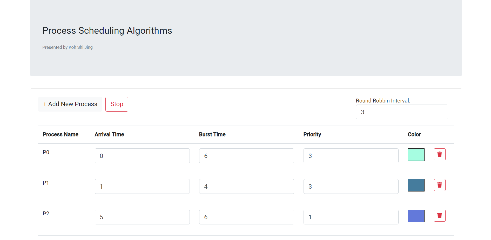
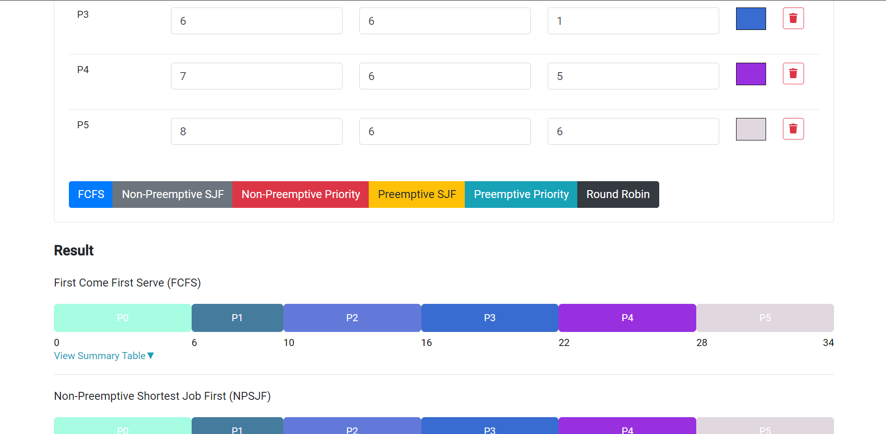
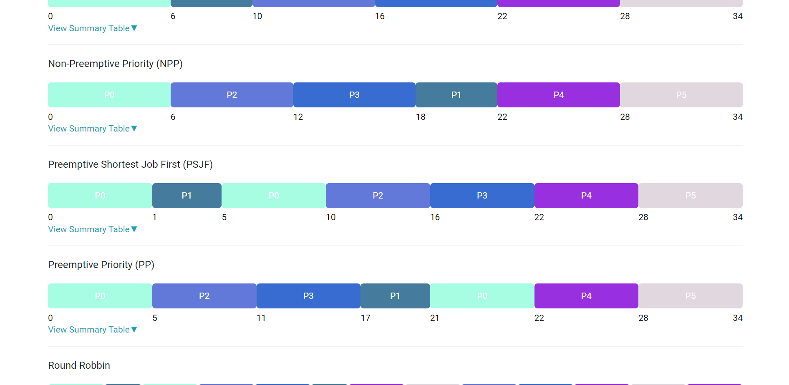

# Process Scheduling Algorithms

CPU scheduling is a process which allows one process to use the CPU while the execution of another process is on hold(in waiting state) due to unavailability of any resource like I/O etc, thereby making full use of CPU. This project has carried out several type of scheduling algorithms including First Come First Serve(FCFS), Shortest Job First, Priority and Round Robbin. 

## Development server

Run `ng serve` for a dev server. Navigate to `http://localhost:4200/`.

## Build

Run `ng build` to build the project.

## Screenshot of Project

